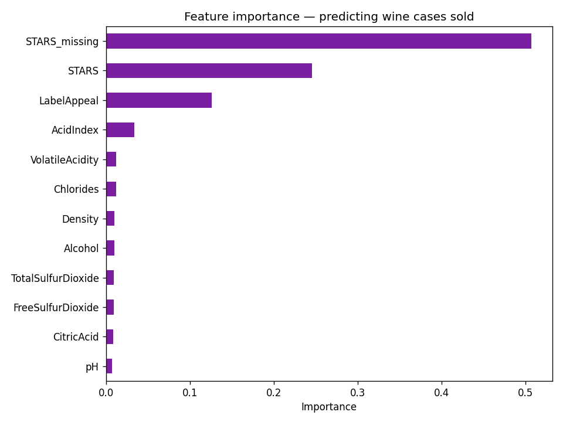
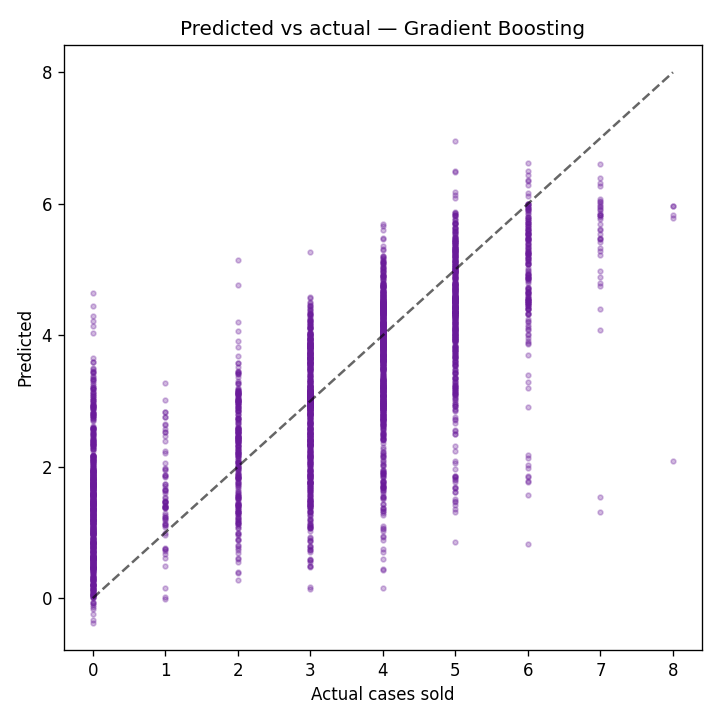

# Wine Sales Analysis & Prediction 🍷

**Clean a messy 12,795-row wine dataset, then predict how many cases of each wine will sell from its chemical profile and review signals.**

 

---

## 💼 Business problem
A wine distributor wants to forecast **demand (cases sold)** for each wine from its measurable properties and review attributes, to guide purchasing and inventory. The raw data is messy — missing chemical readings and unrated wines — so the project is split into **(1) a rigorous cleaning stage** and **(2) a predictive modeling stage**.

## 📊 Dataset
`data/wine_data.csv` (bundled) — **12,795 wines × 16 columns**:
- **Chemistry:** FixedAcidity, VolatileAcidity, CitricAcid, ResidualSugar, Chlorides, Free/TotalSulfurDioxide, Density, pH, Sulphates, Alcohol, AcidIndex
- **Review:** `LabelAppeal`, `STARS` (expert rating, ~26% missing)
- **Target:** `TARGET` = number of cases purchased (count, 0–8)

Several columns have missing values (STARS: 3,359; Sulphates: 1,210; …).

## 🔬 Methodology
1. **Cleaning** ([`notebooks/wine_quality.ipynb`](notebooks/wine_quality.ipynb)) — typing, outlier inspection, **KNN imputation** and **power transforms** to tame skew, per the original assignment.
2. **Prediction (added)** ([`src/predict_wine_sales.py`](src/predict_wine_sales.py)) — regression of `TARGET` with **Linear Regression vs Random Forest vs Gradient Boosting**, reporting RMSE / MAE / R². A **`STARS_missing` indicator** is engineered first, since an *unrated* wine is itself a strong (negative) demand signal.

## 📈 Results

| Model | RMSE | MAE | R² |
|---|---|---|---|
| **Gradient Boosting** | **1.232** | **0.943** | **0.589** |
| Random Forest | 1.245 | 0.950 | 0.581 |
| Linear Regression | 1.310 | 1.030 | 0.536 |

<p align="center">
  
  
</p>

**Takeaway:** Gradient Boosting predicts cases sold with **R² ≈ 0.59** (MAE < 1 case). Review signals dominate — `STARS`, the `STARS_missing` flag, `LabelAppeal`, and `AcidIndex` are the strongest predictors, far more than individual chemistry readings, confirming that *perceived* quality drives demand more than raw chemistry.

## ▶️ How to run
```bash
pip install -r requirements.txt
jupyter lab notebooks/wine_quality.ipynb     # cleaning + imputation
python src/predict_wine_sales.py              # regression + figures
```

## 🛠️ Tech stack
`Python` · `pandas` · `scikit-learn` (KNNImputer, PowerTransformer, ensembles) · `Matplotlib` · `Seaborn`

## 🚀 Future improvements
- Count-appropriate models (Poisson / Negative-Binomial / `HistGradientBoosting` with Poisson loss).
- SHAP values for per-wine demand explanations; hurdle model for the excess of zero-case wines.

---
*Academic project (DAV 6150, M3 "Cleaning a Messy Data Set"), extended from cleaning-only into an end-to-end predictive pipeline.*
